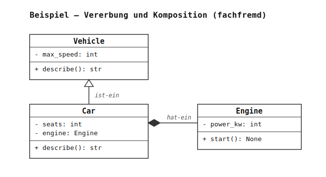
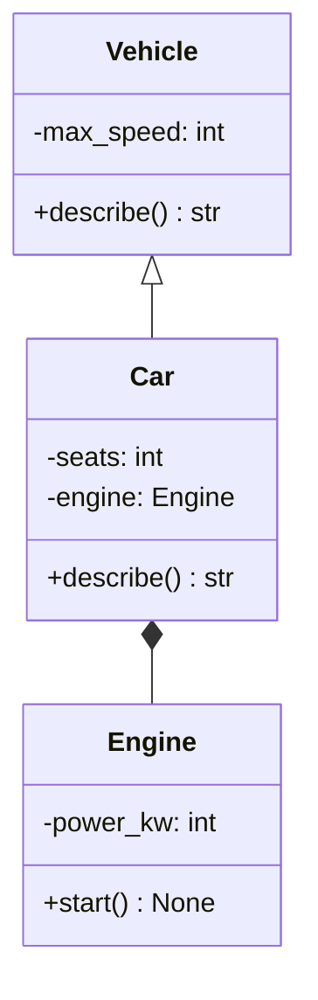

# Howto: UML-Klassendiagramme lesen und zeichnen

Dieses Howto erklärt, wie Sie ein **UML-Klassendiagramm** lesen und selbst erstellen. Es wird in beiden Wegen durch die Lernsituation gebraucht:

- **geleiteter Weg:** Sie *lesen* das mitgelieferte Klassendiagramm, um die Struktur der Klassen zu verstehen.
- **offener Weg:** Sie *zeichnen* Ihr eigenes Klassendiagramm als Entwurf, **bevor** Sie Code schreiben.

Sie brauchen dieses Dokument nicht auswendig zu lernen. Nutzen Sie es als Nachschlagewerk.

---

## 1. Wozu ein Klassendiagramm?

Ein Klassendiagramm zeigt auf einen Blick, **welche Klassen es gibt**, **was sie können** und **wie sie zusammenhängen** — ohne eine einzige Zeile Code zu lesen. In der Berufspraxis ist es das verbreitetste Diagramm der **UML** (Unified Modeling Language), der Standardsprache zum Modellieren objektorientierter Software.

Für den Entwurf gilt: Erst das Diagramm, dann der Code. Wer die Struktur vorher zeichnet, merkt früh, ob Verantwortlichkeiten sauber verteilt sind — und muss nicht mitten in der Implementierung umbauen.

---

## 2. Aufbau einer Klasse

Eine Klasse wird als Rechteck mit **drei Feldern** dargestellt:

```
+---------------------------+
|        ClassName          |   <- Name
+---------------------------+
| - attribute: Typ          |   <- Attribute (Daten)
+---------------------------+
| + method(param): Typ      |   <- Methoden (Verhalten)
+---------------------------+
```

- **Oben:** der Klassenname.
- **Mitte:** die Attribute (die Daten, die ein Objekt speichert), je mit Datentyp.
- **Unten:** die Methoden (das Verhalten), je mit Parametern und Rückgabetyp.

---

## 3. Sichtbarkeit — die Zeichen `+`, `-`, `#`

Vor jedem Attribut und jeder Methode steht ein Sichtbarkeitszeichen. Es sagt, **wer** das Element benutzen darf:

| Zeichen | Bedeutung   | Heißt: erreichbar …                              |
| ------- | ----------- | ------------------------------------------------ |
| `+`     | public      | … von überall (öffentliche Schnittstelle)        |
| `-`     | private     | … nur innerhalb der eigenen Klasse               |
| `#`     | protected   | … in der eigenen Klasse und ihren Unterklassen   |

> **Tellerrand — Python vs. UML/C#/Java (Vorschlag zum Besprechen):** In UML, C# und Java ist Sichtbarkeit eine **harte Regel**, die der Compiler erzwingt — auf ein `private`-Feld kommt man von außen schlicht nicht. In Python ist sie **Konvention**: Ein führender Unterstrich (`_attribut`) signalisiert „privat, bitte nicht von außen anfassen", aber die Sprache verbietet den Zugriff nicht. Beim Zeichnen übersetzen Sie also: Python-`_name` → UML-`-name` (privat); Python-Name ohne Unterstrich → UML-`+name` (öffentlich).

---

## 4. Beziehungen zwischen Klassen

Die drei Beziehungen, die Sie in dieser Lernsituation brauchen:

| Beziehung      | Bedeutung           | Linie / Pfeil                                   |
| -------------- | ------------------- | ----------------------------------------------- |
| **Vererbung**  | „ist-ein"           | durchgezogene Linie mit **hohlem Dreieck** ▷ zur Oberklasse |
| **Komposition**| „hat-ein" (besitzt) | durchgezogene Linie mit **ausgefüllter Raute** ◆ an der besitzenden Klasse |
| **Assoziation**| „kennt / benutzt"   | einfache durchgezogene Linie, ggf. mit Pfeil    |

Merkhilfe:

- Das **Dreieck** ▷ zeigt immer auf die **allgemeinere** Klasse (die Oberklasse). Beispiel: *Auto ist-ein Fahrzeug* → Dreieck zeigt auf `Fahrzeug`.
- Die **Raute** ◆ sitzt bei der Klasse, die die andere **als Bestandteil enthält**. Beispiel: *Auto hat-ein Motor* → Raute sitzt bei `Auto`.

Die Unterscheidung **Vererbung vs. Komposition** ist eine der wichtigsten Entwurfsentscheidungen — das Diagramm macht sie sichtbar.

---

## 5. Ein vollständiges Beispiel

Ein bewusst **fachfremdes** Beispiel (damit es Ihnen die Lösung der Lernsituation nicht vorwegnimmt): ein Fahrzeug, ein davon abgeleitetes Auto, und ein Motor als Bestandteil.



_UMLet-Quelle zum Öffnen und Bearbeiten: [`diagramme/beispiel_uml_howto.uxf`](diagramme/beispiel_uml_howto.uxf)._

Zu lesen als: `Car` **ist-ein** `Vehicle` (erbt `max_speed` und `describe`) und **hat-ein** `Engine` (Komposition; der Motor ist Bestandteil des Autos). `Car.describe()` überschreibt die geerbte Methode. Beachten Sie die beiden Notationen aus Abschnitt 4: das **hohle Dreieck** ▷ zeigt zur Oberklasse `Vehicle`, die **gefüllte Raute** ◆ sitzt bei der besitzenden Klasse `Car`.

---

## 6. Werkzeug: UMLetino (empfohlen)

Zum Zeichnen empfehlen wir **UMLetino** — die Browser-Version von UMLet. Kein Installieren, kein Konto:

1. Öffnen Sie **<https://www.umletino.com>** im Browser.
2. Ziehen Sie aus der Palette rechts eine **Klasse** (`UMLClass`) auf die Zeichenfläche.
3. Beschriften Sie die Klasse im Textfeld rechts. UMLet nutzt `--` als Trennlinie zwischen den drei Feldern:
   ```
   Vehicle
   --
   -max_speed: int
   --
   +describe(): str
   ```
4. Für eine **Beziehung** ziehen Sie ein `Relation`-Element zwischen zwei Klassen und stellen den Linientyp ein:
   - Vererbung (hohles Dreieck): `lt=<<-`
   - Komposition (ausgefüllte Raute): `lt=<<<<-` mit Raute, in UMLet `lt=<-` mit Eigenschaft `m1` — im Zweifel die Beispielvorlagen der Palette nutzen.
5. **Exportieren** Sie über *File → Export as …* als **PNG** oder **SVG**, um das Diagramm in Ihre Abgabe einzubetten.

> **Tipp:** Speichern Sie Ihre Arbeit zusätzlich als `.uxf`-Datei (*File → Save*). Das ist das bearbeitbare UMLet-Format — anders als ein exportiertes Bild können Sie es später wieder öffnen und ändern.

Ein Bild betten Sie in Markdown so ein:

```markdown

```

---

## 7. Alternative: Mermaid (Diagramm als Text)

Wer lieber tippt statt zeichnet, kann **Mermaid** verwenden — das Diagramm wird als Text in einem Markdown-Codeblock beschrieben und automatisch gerendert (auf GitHub direkt; in VS Code mit der Erweiterung *Markdown Preview Mermaid Support*). Dasselbe Beispiel wie oben:

````markdown

````

In Mermaid bedeuten: `<|--` Vererbung (Dreieck), `*--` Komposition (Raute), `-->` Assoziation. Beide Werkzeuge erzeugen dieselbe UML-Notation — wählen Sie das, mit dem Sie schneller vorankommen.

---

## 8. Checkliste vor der Abgabe eines Diagramms

- [ ] Jede Klasse hat Name, Attribute und Methoden in den drei Feldern.
- [ ] Sichtbarkeit (`+` / `-` / `#`) ist bei jedem Element gesetzt.
- [ ] Vererbung ist als Dreieck ▷ zur Oberklasse gezeichnet.
- [ ] Komposition ist als Raute ◆ bei der besitzenden Klasse gezeichnet.
- [ ] Das Diagramm stimmt mit Ihrem Code überein (gleiche Namen, gleiche Beziehungen).
