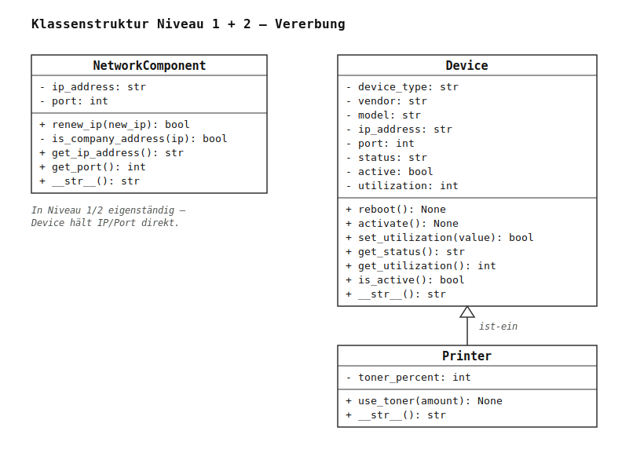
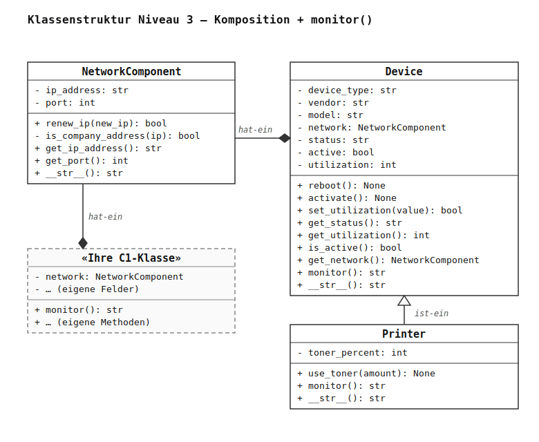

# Lernsituation: Objektorientierte Geräteverwaltung im IT-Support

## 1. Ausgangssituation

> **Gemeinsamer Einstieg zuerst:** Szenario, fachliche Motivation („Warum OOP?"), die vier Grundpfeiler und die Einstiegsfragen für das Unterrichtsgespräch stehen — für beide Wege — in [`docs/einstieg.md`](einstieg.md). Lesen Sie diesen Einstieg, bevor Sie hier weitermachen.

Kurz zur Erinnerung: Sie arbeiten im **OHMega IT-Support** und bauen die **Datengrundlage** für ein späteres Monitoring-Werkzeug — ein Python-Modul, das jedes Netzwerkgerät als Objekt mit definierten Eigenschaften und Methoden modelliert. Diese Modellierung bauen Sie hier **Schritt für Schritt in drei Niveaus** auf.

---

## 2. Ziel

Am Ende der Lernsituation beherrschen Sie die **vier Grundpfeiler der objektorientierten Programmierung** — genau die Konzepte, deren Darstellung und Erklärung in der Abschlussprüfung der Fachinformatiker:innen erwartet wird:

- **Abstraktion** (auch _Generalisierung_) — Sie modellieren reale Netzwerkkomponenten und Geräte als **Klassen** und reduzieren sie auf die für die Aufgabe wesentlichen Attribute und Methoden (Konstruktor, Attribute, Methoden, String-Repräsentation); gemeinsame Eigenschaften ziehen Sie in eine Basisklasse zusammen.
- **Kapselung** — Sie wenden **Datenkapselung** in zwei Spielarten an: _Detail-Verbergen_ (interne Regeln bleiben innen) und _Zugriffsschutz_ (kontrollierter externer Zugriff über lesende Getter und validierende Setter).
- **Vererbung** — Sie modellieren spezialisierte Geräte über eine Basisklasse („Drucker ist-ein Gerät") und vermeiden so doppelten Code.
- **Polymorphismus** — Sie lassen spezialisierte Klassen dieselbe Methode unterschiedlich umsetzen: `Printer.monitor()` **überschreibt** `Device.monitor()`, sodass derselbe Aufruf je nach Objekt das passende Verhalten zeigt.

Darauf aufbauend lernen Sie zwei **erweiterte, aber praxisrelevante Konzepte** kennen, die über die vier Grundpfeiler hinausgehen:

- **Komposition** — Sie bauen eine Klasse aus anderen Objekten auf („Gerät hat-ein Netzwerkkomponente") und wägen sie bewusst gegen die Vererbung ab.
- **Monitoring-Tour** — Sie fragen heterogene Geräte über eine gemeinsame Methode `monitor()` einheitlich ab und sehen Polymorphismus in der Anwendung (in Python über _Duck Typing_) — ein erster Vorgriff auf das spätere Werkzeug.

---

## 3. Dateien und Rollen

| Datei                              | Ihre Rolle                                                                       |
| ---------------------------------- | -------------------------------------------------------------------------------- |
| `it_support.py`                    | **Hier bearbeiten Sie Niveau 1 und 2.** Skelett mit `# TODO`-Markern.            |
| `it_support_n3.py`                 | **Hier bearbeiten Sie Niveau 3.** Niveau 1 und 2 sind bereits vorgegeben.        |
| `docs/howto_setup.md`              | Einrichtung von Python und der Entwicklungsumgebung.                             |
| `docs/howto_pytest.md`             | Bedienung von pytest und Lesen der Testausgaben.                                 |
| `docs/howto_listen.md`             | Refresher zu Python-Listen (relevant ab Niveau 3).                               |
| `docs/testprotokoll_it_support.md` | Vorlage für Ihre Test-Dokumentation.                                             |

Wenn Sie lieber selbstorganisiert ohne kleinschrittige Aufgaben arbeiten, gibt es einen offenen Weg über das Pflichtenheft ([`docs/offen/pflichtenheft_it_support.md`](offen/pflichtenheft_it_support.md)).

---

## 4. Orientierungsfragen — vor Niveau 1

Diese Fragen helfen Ihnen, sich vor Beginn zu orientieren. Die Antworten finden Sie in den oben genannten Materialien; nehmen Sie sich rund 10 Minuten Zeit, bevor Sie mit Aufgabe A1 starten.

1. Welche Rolle hat das Modul, das Sie hier bauen, im Tagesgeschäft des OHMega IT-Supports?
2. Welche zwei Klassen entstehen am Ende der Lernsituation in `it_support.py` zusätzlich zu `NetworkComponent`?
3. In welcher Datei liegt Ihre Hauptarbeit für Niveau 1 und 2 — und welche Datei sollen Sie dabei nicht ändern?
4. Wie führen Sie das Skelett aus der Konsole aus? Was würden Sie sehen, wenn Sie es jetzt unverändert starten?
5. Was sagt es Ihnen über den Ausgangsstand, wenn `python it_support.py` läuft, aber **keine** Ausgabe erzeugt?

---

## 5. Niveau 1 ✦ — Erste Klasse: `NetworkComponent`

Die Klasse `NetworkComponent` modelliert eine Netzwerkschnittstelle eines Firmengeräts. In Niveau 1 lernen Sie die Grundbestandteile einer Klasse kennen: Konstruktor, Attribute, Methoden, String-Repräsentation. Indem Sie entscheiden, welche Eigenschaften (IP-Adresse, Port) für die Aufgabe wesentlich sind — und welche Sie bewusst weglassen —, betreiben Sie bereits **Abstraktion**, den ersten der vier Grundpfeiler aus Kapitel 2.

**Begriffe für dieses Niveau** — schlagen Sie hier nach, wenn ein Wort unklar ist:

| Begriff | In einem Satz |
| --- | --- |
| **Klasse** | Der Bauplan für gleichartige Objekte (Bauplan Haus ↔ konkretes Haus). |
| **Objekt / Instanz** | Eine konkrete Ausprägung einer Klasse, erzeugt mit `NetworkComponent(...)`. |
| **Konstruktor** (`__init__`) | Spezielle Methode, die **einmal bei der Erzeugung** eines Objekts läuft und seine Attribute einrichtet. |
| **Attribut** | Ein **Wert**, den das Objekt speichert (z. B. `_ip_address`) — er gehört dem Objekt, nicht nur der Methode. |
| **Methode** | Eine Funktion, die zur Klasse gehört und auf den Daten des Objekts arbeitet. |
| **`__str__`** | Eine „Magic Method": liefert die Text-Repräsentation und wird von `print(obj)` und `str(obj)` **automatisch** aufgerufen. |

### Aufgabe A1 — Grundstruktur

Implementieren Sie den Konstruktor `__init__(self, ip_address)`:

- Speichern Sie `ip_address` in `self._ip_address`.
- Setzen Sie `self._port = 8080`.

### Aufgabe A2 — Lese-Methoden und String-Ausgabe

Implementieren Sie:

- `get_ip_address(self) -> str` — liefert die aktuelle IP-Adresse.
- `get_port(self) -> int` — liefert den Port.
- `__str__(self) -> str` — liefert eine sprechende Repräsentation, z. B.:
  ```
  NetworkComponent(IP: 192.168.10.42, Port: 8080)
  ```

### Kontrollfragen Niveau 1

1. Was bedeutet der Parameter `self` in einer Methode? Warum müssen Sie ihn im `def` schreiben, beim Aufruf aber nicht angeben?
2. Warum heißt das Attribut `_ip_address` mit Unterstrich und nicht einfach `ip_address`?

---

## 6. Niveau 2 ✦✦ — Datenkapselung und Vererbung

Niveau 2 hebt Klassen vom „Datencontainer mit Funktionen" zur **gekapselten Einheit**: Sie unterscheiden, welche Information nach außen sichtbar ist, welche nur lesbar, welche gar nicht erreichbar — und welche Schreibzugriffe zuvor geprüft werden müssen.

**Begriffe für dieses Niveau** — ergänzend zu Niveau 1:

| Begriff | In einem Satz |
| --- | --- |
| **Getter / Lese-Methode** | Methode, die einen (oft gekapselten) Attributwert nach außen **liefert**, z. B. `get_status()`. |
| **Setter** | Methode, die einen Attributwert von außen **ändert**; ein _validierender_ Setter weist ungültige Werte ab (z. B. `set_utilization`). |
| **`super()`** | Ruft die Methode der **Elternklasse** auf (z. B. `super().__init__(...)`), um deren Verhalten zu nutzen, statt es zu wiederholen. |

### Aufgabe B1 — Detail-Verbergen in `renew_ip`

Außenstehende sollen die IP einer `NetworkComponent` ändern können, aber **nicht beliebig**: nur Firmen-Adressen sind zulässig. Die Regel, was eine Firmen-Adresse ist, lebt **innerhalb** der Klasse — niemand außerhalb soll sie umgehen oder ablesen können.

Implementieren Sie:

- `_is_company_address(self, ip) -> bool` — interne Hilfsmethode. Liefert `True` genau dann, wenn `ip` mit `192.168.` beginnt. _Tipp:_ `str.startswith()` hilft hier.
- `renew_ip(self, new_ip) -> bool` — prüft die neue IP über `_is_company_address`:
  - Wenn ungültig: Ablehnungs-Meldung mit `print()` ausgeben, `False` zurückgeben.
  - Wenn gültig: Änderungs-Meldung ausgeben, IP übernehmen, `True` zurückgeben.

> **Wichtig:** Es gibt **bewusst keinen** öffentlichen Setter `set_ip_address`. Außenstehende kennen die Validierungsregel nicht und können sie nicht umgehen — das ist der Sinn von Datenkapselung als _Detail-Verbergen_.

### Aufgabe B2a — `Device` als Basisklasse für Geräte

Implementieren Sie die Klasse `Device` mit Konstruktor `__init__(self, device_type, vendor, model, ip_address)`:

- Speichern Sie alle vier Argumente in entsprechenden Attributen mit `_`-Präfix.
- Setzen Sie zusätzlich:
  - `_port = 8080`
  - `_status = "offline"`
  - `_active = False`
  - `_utilization = 0`

Ergänzen Sie:

- `reboot(self) -> None` — gibt eine Neustart-Meldung mit Gerätetyp, Modell und IP aus; setzt anschließend `_status = "online"`, `_active = False`, `_utilization = 0`.
- `activate(self) -> None` — setzt `_active = True`.
- `__str__(self) -> str` — sprechende Repräsentation mit allen sichtbaren Informationen.

### Aufgabe B2b — Drei Muster des Zugriffsschutzes

Datenkapselung hat mehrere Spielarten. Implementieren Sie in `Device` drei verschiedene Zugriffsmuster nebeneinander:

| Muster                                         | Methoden / Felder                                                                                                            |
| ---------------------------------------------- | ---------------------------------------------------------------------------------------------------------------------------- |
| **Validierender Setter** (lehnt ungültige Werte ab) | `set_utilization(self, value) -> bool` — außerhalb 0..100 Ablehnungs-Meldung und `False`, sonst speichern und `True`.    |
| **Nur lesbare Getter** (kein Setter)           | `get_status(self)`, `get_utilization(self)`, `is_active(self)`                                                               |
| **Init-only ohne Getter** (nur in `__str__` sichtbar) | `_vendor`, `_model`, `_device_type` — keine Getter, keine Setter                                                       |

> **Hinweis:** `_status` und `_active` sind von außen lesbar, aber nicht direkt setzbar. Sie ändern sich ausschließlich durch `reboot()` bzw. `activate()`. Das ist kein Versehen — der Lebenszyklus eines Geräts soll von außen nur über die dafür vorgesehenen Aktionen ausgelöst werden.

### Aufgabe B3 — Vererbung: `Printer` ist-ein `Device`

Implementieren Sie die Klasse `Printer(Device)`:

- Konstruktor `__init__(self, vendor, model, ip_address)`. Rufen Sie `super().__init__("Drucker", vendor, model, ip_address)` auf. Initialisieren Sie zusätzlich `_toner_percent = 100`.
- `use_toner(self, amount) -> None` — reduziert `_toner_percent` um `amount`.
- `__str__(self) -> str` — erweitert die Eltern-Repräsentation um den Tonerstand. _Tipp:_ `super().__str__()` liefert die Basis-Information.

### Kontrollfragen Niveau 2

1. Warum hat `Device` einen `set_utilization(...)`-Setter, aber **keinen** `set_status(...)`-Setter?
2. Was passiert, wenn Sie in `Printer.__init__` den `super().__init__(...)`-Aufruf weglassen?
3. Warum ist `_is_company_address` mit Unterstrich gekennzeichnet, `renew_ip` aber nicht?
4. Warum ist es eine schlechte Idee, in `Printer.__str__` die Eltern-Information komplett neu aufzuschreiben statt `super().__str__()` aufzurufen?

### Zwischenstand: Ihre Klassenstruktur nach Niveau 2

Damit ist die erste Ausbaustufe dokumentiert. Drei Klassen in `it_support.py`: `Printer` **ist-ein** `Device` (Vererbung), `NetworkComponent` steht noch eigenständig daneben.



> _UML lesen:_ `+` = öffentlich, `-` = privat/intern; das Dreieck ▷ zeigt Vererbung. Wie man solche Diagramme liest und selbst zeichnet, erklärt [`howto_uml.md`](howto_uml.md).

---

## 7. Niveau 3 ✦✦✦ — Komposition und Polymorphismus

> **Wechsel der Datei:** Für Niveau 3 arbeiten Sie ab jetzt in `it_support_n3.py`. Dort sind `NetworkComponent`, `Device` und `Printer` bereits vollständig vorgegeben — mit zwei Änderungen gegenüber Ihrem Niveau-2-Stand:
>
> 1. `Device` enthält jetzt eine `NetworkComponent` als Attribut (`_network`), statt IP und Port direkt zu speichern. Das ist **Komposition** („hat-ein").
> 2. `Device` und `Printer` haben eine neue Methode `monitor() -> str`, die eine kompakte Status-Zeile für die Überwachung liefert. `Printer.monitor()` überschreibt `Device.monitor()` und ergänzt den Tonerstand.
>
> Schauen Sie sich die vorgegebenen Klassen genau an, bevor Sie loslegen.

So sieht der vorgegebene Stand aus — `Device` hält die `NetworkComponent` jetzt als Bestandteil (Raute ◆ = Komposition). Ihre eigene Klasse aus **Aufgabe C1** ergänzen Sie an der gestrichelt angedeuteten Stelle:



> **Begriff — Polymorphismus (der vierte Grundpfeiler):** Dass `Printer.monitor()` die geerbte `Device.monitor()` **überschreibt** und derselbe Aufruf `geraet.monitor()` je nach Objekt eine andere Ausgabe liefert, ist **Polymorphismus** („Vielgestaltigkeit"). In der Monitoring-Tour (C2) sehen Sie ihn in Reinform: Eine Schleife ruft auf jedem Objekt dasselbe `monitor()` auf, ohne dessen konkreten Typ zu kennen. In Python trägt das **Duck Typing** (siehe C2), in Java/C# erzwingt ein gemeinsames `Interface` dasselbe — der zugrunde liegende OOP-Pfeiler ist in beiden Welten identisch. Genau diese Verbindung von _Überschreiben_ und _einheitlichem Aufruf_ sollten Sie für die Prüfung benennen können.

### Aufgabe C1 — Eigene Klasse mit Komposition und `monitor()`

Entwerfen Sie eine **eigenständige neue Klasse**, die `NetworkComponent` per Komposition nutzt und **nicht** von `Device` erbt. Wählen Sie ein realistisches Szenario aus dem IT-Umfeld, z. B.:

- Raumsensor (Temperatur, Luftfeuchte, CO₂)
- IP-Telefon
- Türverriegelung
- Smart-Display in einem Besprechungsraum
- Patch-Panel-Port mit Status-LED

Anforderungen:

- mindestens drei Attribute, davon eines `_network: NetworkComponent`,
- mindestens eine Methode, die den Zustand des Objekts sinnvoll ändert,
- `get_network()` für den Lese-Zugriff auf die Netzwerk-Komponente,
- `monitor() -> str` — kompakte Statuszeile für die Überwachung (Format frei, aber sprechend),
- sprechende `__str__()`-Repräsentation.

Schreiben Sie Ihre Klasse an die markierte Stelle in `it_support_n3.py`.

### Aufgabe C2 — Monitoring-Tour über eine heterogene Liste

Erweitern Sie `main()` um eine Monitoring-Tour:

1. Bauen Sie eine Liste, die mindestens den Drucker und eine Instanz Ihrer C1-Klasse enthält.
2. Iterieren Sie mit `for ... in ...` über die Liste und rufen Sie für jedes Element `monitor()` auf. Geben Sie das Ergebnis aus.

> **Hinweis:** Damit das funktioniert, muss **jedes** Objekt in der Liste eine `monitor()`-Methode anbieten. Vergessen Sie diese in C1, bekommen Sie zur Laufzeit einen `AttributeError`. Falls Sie noch nicht sicher mit Listen sind: kurzer Refresher in [`docs/howto_listen.md`](howto_listen.md).

> **Tellerrand — Python vs. C#/Java:** Python prüft erst beim Aufruf, ob eine Methode existiert. Dieses Prinzip nennt sich **Duck Typing** („Wenn es wie eine Ente quakt, ist es eine Ente"). C# und Java verlangen, dass Sie zuvor ein gemeinsames `Interface` deklarieren — der Compiler erzwingt es schon vor der Programmausführung. Beides hat Vor- und Nachteile; dazu mehr in C3.

### Aufgabe C3 — Reflexion: Komposition oder Vererbung?

Beantworten Sie schriftlich (jeweils 2–4 Sätze):

1. Warum erbt Ihre C1-Klasse **nicht** von `Device`? Welche Eigenschaft eines Geräts wäre auf Ihre Klasse falsch übertragen worden?
2. Woran erkennen Sie beim Entwurf einer neuen Klasse, ob Komposition („hat-ein") oder Vererbung („ist-ein") der passende Weg ist?
3. C# und Java zwingen Sie, eine gemeinsame Schnittstelle (`Interface`) explizit zu deklarieren, bevor verschiedene Klassen einheitlich aufgerufen werden dürfen. Python verlangt das nicht — eine gleichnamige Methode genügt. Welchen Vor- und welchen Nachteil sehen Sie im Python-Weg?

### Aufgabe C4 ✦ Bonus — `@property`

Recherchieren Sie das `@property`-Pattern in Python (Stichworte: `@property`, `@<name>.setter`). Wandeln Sie für **eine** Klasse Ihrer Wahl (z. B. Ihre C1-Klasse oder `Device`) einen Getter/Setter in eine `@property` mit zugehörigem Setter um. Behalten Sie eine bestehende Validierungslogik (etwa die 0..100-Prüfung in `set_utilization`) bei.

### Kontrollfragen Niveau 3

1. Was ändert sich in `Device.__str__()` durch die Komposition mit `NetworkComponent` gegenüber dem Niveau-2-Stand? Warum?
2. Wenn Sie in der Monitoring-Tour eine Liste `[printer, my_thing, "192.168.1.1"]` iterieren würden — was passiert beim dritten Element, und warum?
3. Wäre es sinnvoll, dass auch Ihre C1-Klasse von `NetworkComponent` erbt, statt `_network` als Attribut zu halten? Begründen Sie.
4. Erklären Sie an genau diesem Beispiel, was **Polymorphismus** bedeutet: Welche Rolle spielt das Überschreiben von `monitor()`, und welche Rolle spielt der einheitliche Aufruf in der Monitoring-Tour?

---

## 8. Ausblick

Das Datenmodell, das Sie hier gebaut haben, ist die Grundlage für ein echtes Monitoring-Werkzeug: über die Methode `monitor()` lässt sich jedes registrierte Gerät einheitlich abfragen — egal, ob Drucker, Sensor oder Ihre eigene Geräteklasse. Im Berufsalltag treffen Sie die gleichen Strukturen wieder:

- in **CMDB-Systemen** (ServiceNow, i-doit, OTRS),
- in **Monitoring-Tools** (Nagios, Zabbix, Prometheus, Grafana),
- in **Automatisierungs-Frameworks** (Ansible, Puppet, Terraform — dort sind „Resources" Objekte),
- bei der Arbeit mit **REST-APIs**, deren JSON-Antworten typischerweise in vergleichbare Klassen geladen werden.

Wenn Sie später mit C# oder Java arbeiten, finden Sie die hier gelernten Konzepte fast 1:1 wieder — die vier Grundpfeiler **Abstraktion, Kapselung, Vererbung und Polymorphismus** sowie die ergänzende **Komposition** sind sprachübergreifend.
